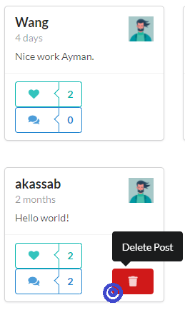

# ChatLux

<a href="https://ak-social-media.netlify.app/">Live Demo</a>

Here I created a secure social media web application using:
- Node.js for speed (back-end)
- GraphQL for the scalable and straightforward API (back-end)
- Caching with Apollo Client
- React + Semantic UI for the beautiful dynamic look
- MongoDB for a flexible database

## Quick Functions
- Register, Login (with input validation)
- Like, Unlike, Like-count
- Comment, Comment-count
- Post, Delete-post
- Unique routes for individual posts

## The Details
- Register form + validation

- Also checks if account even exists in the system

- You can only delete your own posts
- With tool-tips

- Individual pages for comments

## Language
- HTML, CSS, JavaScript
- GQL

## Tools/Libraries
- React + Semantic UI
- Node.js + Express + GraphQL
- MongoDB

## Deployment
- Front-end: Netlify
- Back-end API: Heroku

